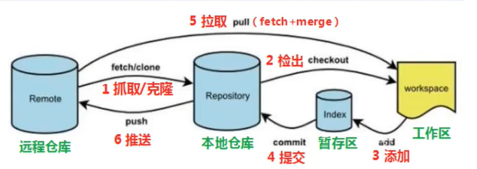

# Git分布式版本控制工具

> 参考视频：[Git学习-哔哩哔哩](https://www.bilibili.com/video/BV1MU4y1Y7h5?p=1&vd_source=d13fed8345cf3fc82c8c32365f9b43ef)
>
> 参考文档：[Git 教程 | 菜鸟教程](https://www.runoob.com/git/git-tutorial.html)

## 简介

### 版本控制器方式

* **集中式版本控制工具**，如SVN、CVS

  ​		版本库是集中存放在中央服务器的，team里每个人work时从中央服务器下载代码，时必须联网才能工作，局域网或互联网。个人修改然后提交到中央管理库。

* **分布式版本控制工具**，如Git

  ​		分布式版本控制系统没有“中央服务器”，每个人的电脑上都是一个完整的版本库，这样工作的时候，无需联网了。多人协作只需要各自的修改推送给对方，就能互相看到对方的修改了。

### Git工作流程图



```powershell
1. clone（克隆）：从远程仓库中克隆代码到本地仓库
2. checkout（检出）：从本地仓库中检出一个仓库分支然后进行修订
3. add（添加）：在提交前先将代码提交到暂存区
4. commit（提交）：提交到本地仓库。本地仓库中保存修改的各个历史版本
5. fetch（抓取）：从远程库抓取到本地仓库，不进行任何的合并动作，一般操作比较少
6. pull（拉取）：从远程库拉到本地库，自动进行合并（merge），然后放到工作区，相当于fetch+merge
7. push（推送）：修改完成后，需要和团队成员共享代码时，将代码推送到远程仓库
```

## 安装配置

### 安装

> 官网链接：[Git - Downloads (git-scm.com)](https://git-scm.com/downloads)

### 配置用户信息

```shell
git config --global user.name "lin"
git config --blobal user.email "1604478759@qq.com"
```

### 查看配置信息

```shell
git config --blobal user.name
git config --blobal user.email
```

### 解决中文乱码问题

1. 打开Git Bash执行下面命令

```shell
git config --global core.quotepath false
```

2. ${git_home}/etc/bash.bashrc 文件最后加入下面两行

```shell
export LANG="zh_CN.UTF-8"
export LC_ALL="zh_CN.UTF-8"
```